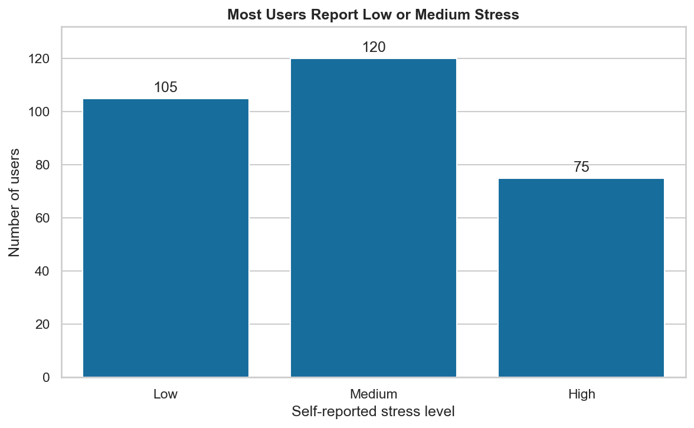
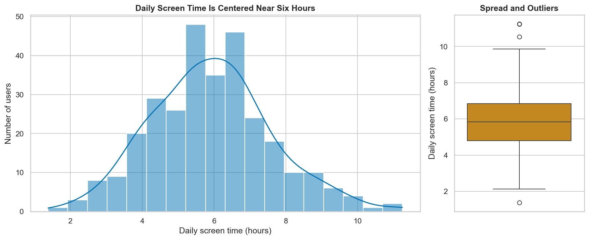
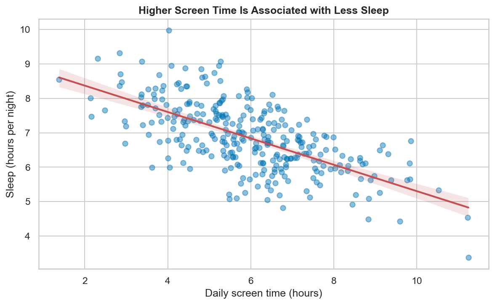
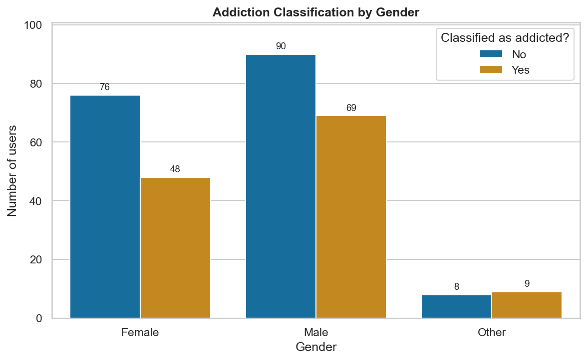
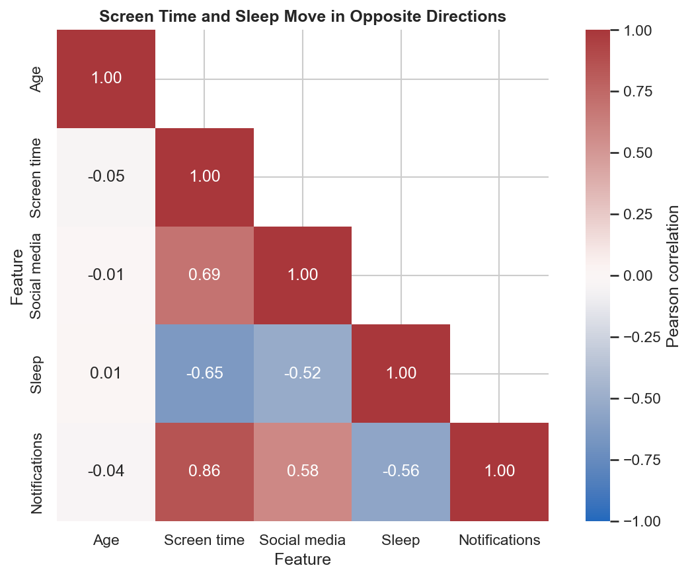
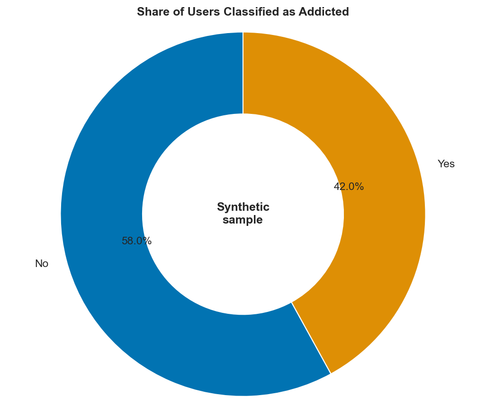

# Kaggle Playground Competitions
This repo contains a few entries I have completed for a number of **Kaggle playground competitions**. If you are not familiar, Kaggle is a data science competition platform (with Google as a parent company) where companies / organizations can arrange data science competitions for any individual / team to collaborate and come up with the most ideal solution for a data science problem. The winners of these competitions often would receive a good amount of money. Given the rise in Generative AI, Kaggle has had a slight falling off in terms of data science competitions, but to keep interest going for folks like myself, they introduced the playground competition series. As the name implies, these are monthly competitions created by Kaggle themselves with only Kaggle swag as the prize. Generally speaking, the datasets / data problems are generally based on another already existing Kaggle dataset, except Kaggle applies something to the raw training data so that it's not the exact same as the original dataset.

While I am not a regular participant in these playground competitions, I like to participate every now and then to keep my own data science skills fresh. Though these competitions only have swag as a prize, these playground competitions can still be very competitive, so each time I participate, I have no expectation that I'll actually win. And that's okay with me! Might sound cheesy, but for me, learning is winning. 😁

## Common Data Visualizations
To ensure a thorough understanding of my work, I attempt to not lean on AI coding tools as much as possible. As I type this (August 2026), I am currently slated to fly to Phoenix and don't expect to have internet connectivity. Because I don't do them that often, my data visualization skills are not perfect. As such, I'll have my buddy Codex fill out the remainder of this section with common data visualizations and how to produce them appropriately.

The examples below form a small, copy-and-paste reference for exploratory data analysis with pandas, matplotlib, and seaborn. They use synthetic smartphone data so that they can run without downloading a competition dataset. Use the shared setup once, then run any individual visualization recipe.

### Choosing a Visualization

| Question | Recommended visualization |
| --- | --- |
| How often does each category occur? | Bar or count plot |
| How is one numeric feature distributed? | Histogram with KDE, plus a box plot |
| How do two numeric features relate? | Scatter plot, optionally with a trend line |
| How does a category differ across groups? | Grouped bar or count plot |
| Which numeric features move together? | Correlation heatmap |
| What share of a small whole belongs to each category? | Donut chart, used sparingly |

### Shared Setup

The fixed random seed makes the example data and rendered plots reproducible. The relationships in this dataset are intentionally synthetic and should not be interpreted as findings from the season 6 competition.

```python
import numpy as np
import pandas as pd
import matplotlib.pyplot as plt
import seaborn as sns

# Creating reproducible synthetic smartphone-usage data
rng = np.random.default_rng(42)
num_rows = 300

daily_screen_time = np.clip(rng.normal(6.0, 1.8, num_rows), 1.0, 12.0)
social_media_time = np.clip(
    (daily_screen_time * 0.45) + rng.normal(0.3, 0.8, num_rows),
    0.0,
    8.0,
)
sleep_time = np.clip(
    9.0 - (daily_screen_time * 0.35) + rng.normal(0.0, 0.75, num_rows),
    3.0,
    10.0,
)
notifications = rng.poisson(20 + (daily_screen_time * 8))
stress_score = daily_screen_time - (sleep_time * 0.4) + rng.normal(0.0, 0.8, num_rows)
addiction_score = (
    (daily_screen_time * 0.7)
    + (notifications * 0.015)
    - (sleep_time * 0.4)
    + rng.normal(0.0, 0.7, num_rows)
)

df = pd.DataFrame(
    {
        "age": rng.integers(18, 36, num_rows),
        "gender": rng.choice(
            ["Female", "Male", "Other"],
            size = num_rows,
            p = [0.47, 0.47, 0.06],
        ),
        "daily_screen_time_hours": daily_screen_time,
        "social_media_hours": social_media_time,
        "sleep_hours": sleep_time,
        "notifications_per_day": notifications,
        "stress_level": pd.qcut(
            stress_score,
            q = [0.0, 0.35, 0.75, 1.0],
            labels = ["Low", "Medium", "High"],
        ),
        "addicted": np.where(
            addiction_score >= np.quantile(addiction_score, 0.58),
            "Yes",
            "No",
        ),
    }
)

# Applying a readable, colorblind-friendly default theme
sns.set_theme(style = "whitegrid", palette = "colorblind")
```

### Finishing a Visualization

- Write a title that describes the subject or takeaway, not merely the chart type. For example, prefer `Daily Screen Time Is Centered Near Six Hours` over `Screen Time Histogram`.
- Replace raw column names with human-readable axis labels and include units such as `Hours per day` or `Notifications per day`.
- Add a legend only when color, marker shape, or line style represents another variable. Give it a meaningful title, and remove it when the labels are already written directly on the chart.
- Label bars when exact values matter, order categories intentionally, and rotate tick labels only when they would otherwise overlap.
- Use transparency for overlapping points, choose histogram bins that preserve the distribution's shape, and prefer colorblind-friendly palettes.
- Finish with `fig.tight_layout()` so titles and labels are not clipped.

### Categorical Counts

Use a bar or count plot to compare the frequency of categories. Choose a logical order when one exists, and add value labels only when the chart is not too crowded.

```python
# Defining the logical category order
stress_order = ["Low", "Medium", "High"]

# Plotting the number of users in each stress category
fig, ax = plt.subplots(figsize = (8, 5))
sns.countplot(
    data = df,
    x = "stress_level",
    order = stress_order,
    color = sns.color_palette("colorblind")[0],
    ax = ax,
)

# Adding readable context and exact values
ax.set_title("Most Users Report Low or Medium Stress", weight = "bold")
ax.set_xlabel("Self-reported stress level")
ax.set_ylabel("Number of users")
ax.bar_label(ax.containers[0], padding = 3, fmt = "{:,.0f}")
ax.margins(y = 0.1)

fig.tight_layout()
plt.show()
```



### Numeric Distributions

A histogram shows the shape of a numeric distribution, while a KDE adds a smoothed estimate and a box plot summarizes its center, spread, and possible outliers. Avoid KDEs for discrete values such as counts.

```python
# Comparing the detailed distribution with its compact summary
fig, axes = plt.subplots(
    ncols = 2,
    figsize = (12, 5),
    gridspec_kw = {"width_ratios": [3, 1]},
)

sns.histplot(
    data = df,
    x = "daily_screen_time_hours",
    bins = 18,
    kde = True,
    ax = axes[0],
)
axes[0].set_title("Daily Screen Time Is Centered Near Six Hours", weight = "bold")
axes[0].set_xlabel("Daily screen time (hours)")
axes[0].set_ylabel("Number of users")

sns.boxplot(
    data = df,
    y = "daily_screen_time_hours",
    color = sns.color_palette("colorblind")[1],
    ax = axes[1],
)
axes[1].set_title("Spread and Outliers", weight = "bold")
axes[1].set_xlabel("")
axes[1].set_ylabel("Daily screen time (hours)")

fig.tight_layout()
plt.show()
```



### Numeric Relationships

Use a scatter plot to examine the direction, strength, and shape of a relationship between two numeric features. Transparency reduces overplotting; a regression line can summarize a roughly linear trend without proving causation.

```python
# Plotting individual observations and a linear trend
fig, ax = plt.subplots(figsize = (8, 5))
sns.regplot(
    data = df,
    x = "daily_screen_time_hours",
    y = "sleep_hours",
    scatter_kws = {"alpha": 0.45, "s": 35},
    line_kws = {"color": "#C44E52", "linewidth": 2},
    ax = ax,
)

# Describing both variables and the observed pattern
ax.set_title("Higher Screen Time Is Associated with Less Sleep", weight = "bold")
ax.set_xlabel("Daily screen time (hours)")
ax.set_ylabel("Sleep (hours per night)")

fig.tight_layout()
plt.show()
```



### Grouped Categorical Comparisons

Use a grouped count plot when a second category divides each bar into a small number of meaningful groups. Raw counts are appropriate when group sizes are comparable; calculate percentages first when they are not.

```python
# Defining stable category and legend orders
gender_order = ["Female", "Male", "Other"]
addiction_order = ["No", "Yes"]

# Comparing addiction classifications within each gender category
fig, ax = plt.subplots(figsize = (8, 5))
sns.countplot(
    data = df,
    x = "gender",
    hue = "addicted",
    order = gender_order,
    hue_order = addiction_order,
    ax = ax,
)

# Labeling groups and explaining the color encoding
ax.set_title("Addiction Classification by Gender", weight = "bold")
ax.set_xlabel("Gender")
ax.set_ylabel("Number of users")
ax.legend(title = "Classified as addicted?")

for container in ax.containers:
    ax.bar_label(container, padding = 3, fmt = "{:,.0f}", fontsize = 9)

ax.margins(y = 0.12)
fig.tight_layout()
plt.show()
```



### Correlation Heatmaps

A correlation heatmap summarizes pairwise linear relationships among numeric features. Correlation ranges from `-1` to `1`; it does not establish causation and can miss non-linear relationships.

```python
# Selecting and renaming numeric features for a readable matrix
correlations = (
    df[
        [
            "age",
            "daily_screen_time_hours",
            "social_media_hours",
            "sleep_hours",
            "notifications_per_day",
        ]
    ]
    .rename(
        columns = {
            "age": "Age",
            "daily_screen_time_hours": "Screen time",
            "social_media_hours": "Social media",
            "sleep_hours": "Sleep",
            "notifications_per_day": "Notifications",
        }
    )
    .corr()
)

# Masking duplicate values above the diagonal
mask = np.triu(np.ones_like(correlations, dtype = bool), k = 1)

# Plotting annotated Pearson correlations
fig, ax = plt.subplots(figsize = (8, 6))
sns.heatmap(
    correlations,
    mask = mask,
    annot = True,
    fmt = ".2f",
    cmap = "vlag",
    center = 0,
    vmin = -1,
    vmax = 1,
    square = True,
    cbar_kws = {"label": "Pearson correlation"},
    ax = ax,
)

ax.set_title("Screen Time and Sleep Move in Opposite Directions", weight = "bold")
ax.set_xlabel("Feature")
ax.set_ylabel("Feature")

fig.tight_layout()
plt.show()
```



### Part-to-Whole Comparisons

Donut and pie charts work best with roughly two to five categories and obvious differences in share. Prefer a sorted bar chart when precise comparisons matter or when there are many categories.

```python
# Counting and ordering the two parts of the whole
addiction_counts = df["addicted"].value_counts().reindex(["No", "Yes"])

# Plotting a donut chart with direct labels instead of a redundant legend
fig, ax = plt.subplots(figsize = (7, 6))
ax.pie(
    addiction_counts,
    labels = addiction_counts.index,
    autopct = "%1.1f%%",
    startangle = 90,
    colors = sns.color_palette("colorblind", n_colors = 2),
    wedgeprops = {"width": 0.45, "edgecolor": "white"},
    textprops = {"fontsize": 11},
)

ax.set_title("Share of Users Classified as Addicted", weight = "bold")
ax.text(0, 0, "Synthetic\nsample", ha = "center", va = "center", weight = "bold")
ax.axis("equal")

fig.tight_layout()
plt.show()
```



### Saving a Figure

To save any figure, place this line after `fig.tight_layout()` and before `plt.show()`:

```python
# Saving a high-resolution image without clipping labels
fig.savefig("visualization.png", dpi = 150, bbox_inches = "tight")
```
